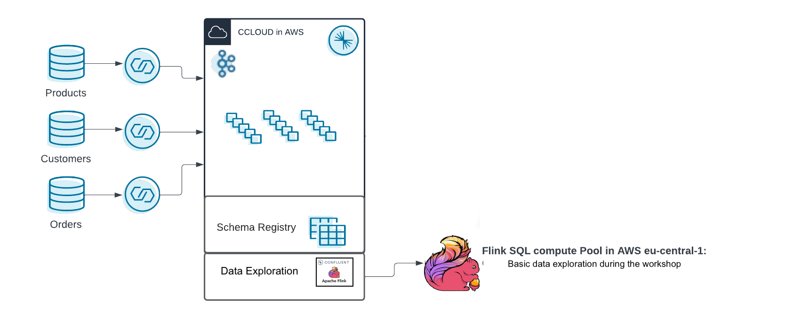

# Confluent Cloud Workshop

You want to get an overview of shoe sales, understand your customers better, and you'd like to start a loyalty program, too. Unfortunately, you don't have yet a Data Streaming Platform. This workshp will guide you through the basics components of Confluent Cloud so the next time you'll be able to leverage Confluent Flink SQL for some ad-hoc analyses, and determine which of your customers are currently eligible for a free pair of shoes!

In this workshop, we will build the Data Streaming Platform of a Shoe Store Loyalty Engine. We will use Confluent Cloud and Confluent Flink on AWS . You can find an architecture diagram below.

## Required Confluent Cloud Resources
The hands-on consists of one lab (see below), and these require Confluent Cloud infrastructure that you'll be provisioning during this workshop.

## Pre-requisites
- A username and password to connect to Confluent Cloud.
- It is not mandatory but you may want to install Confluent CLI on your laptop, [install the cli](https://docs.confluent.io/confluent-cli/current/install.html) 

**Let's Start with [Lab1](lab1.md)**