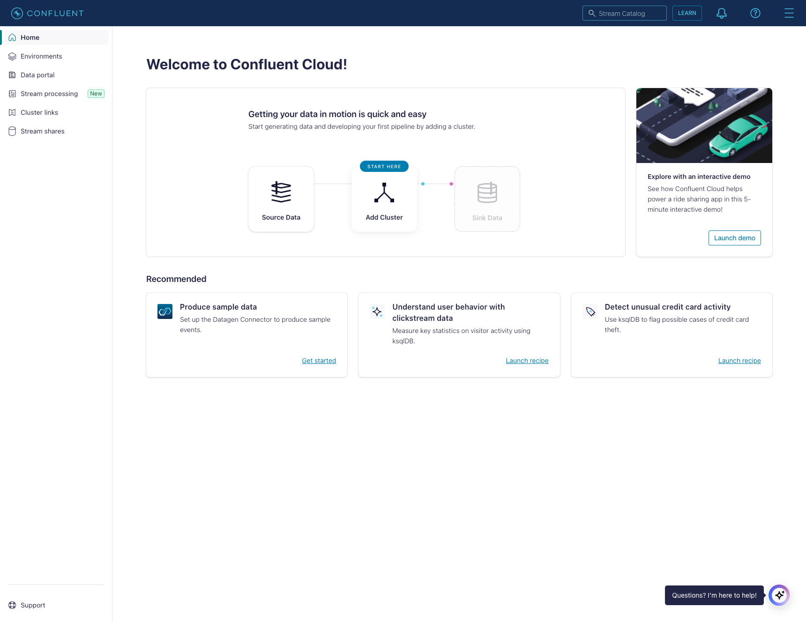
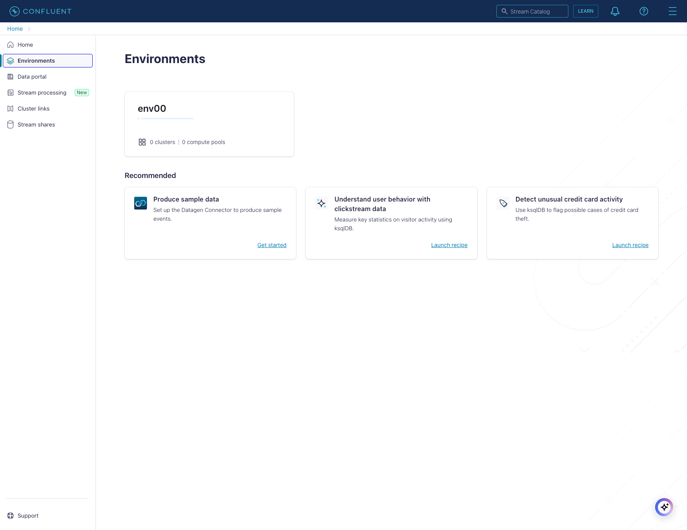
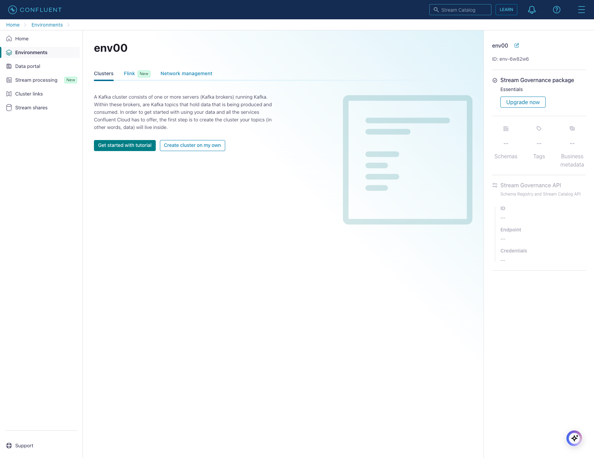
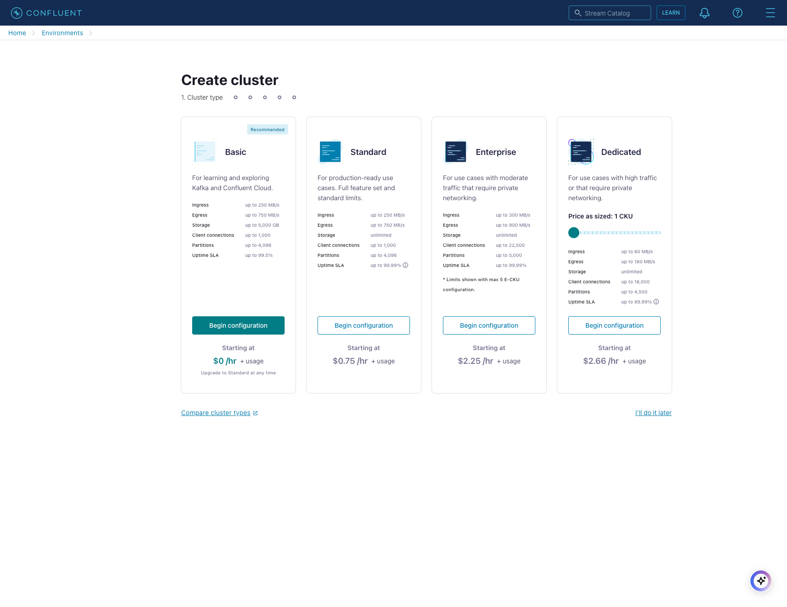
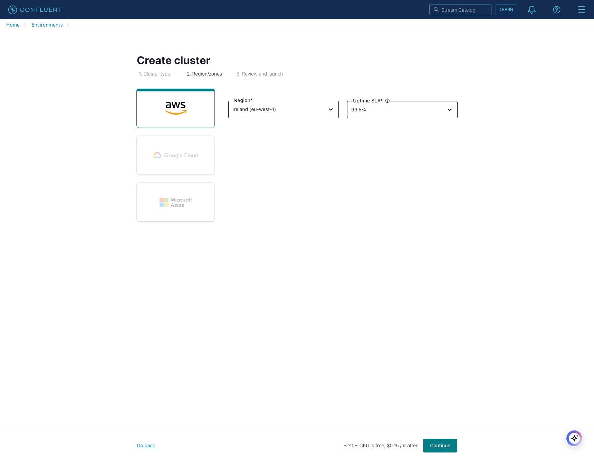
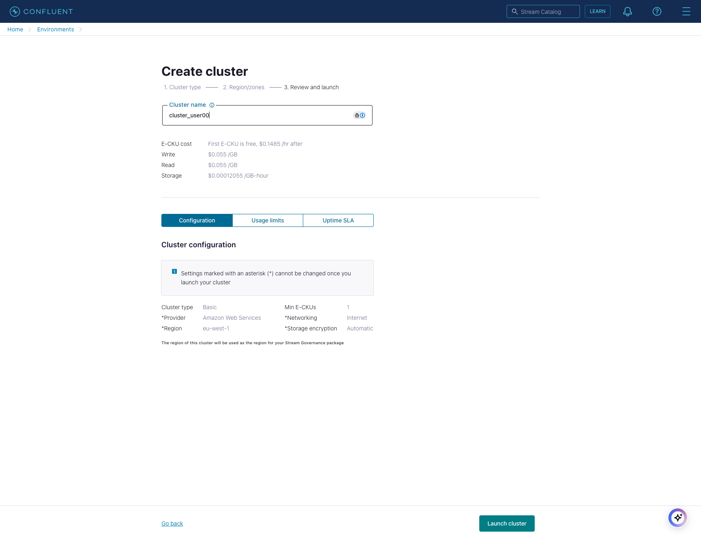
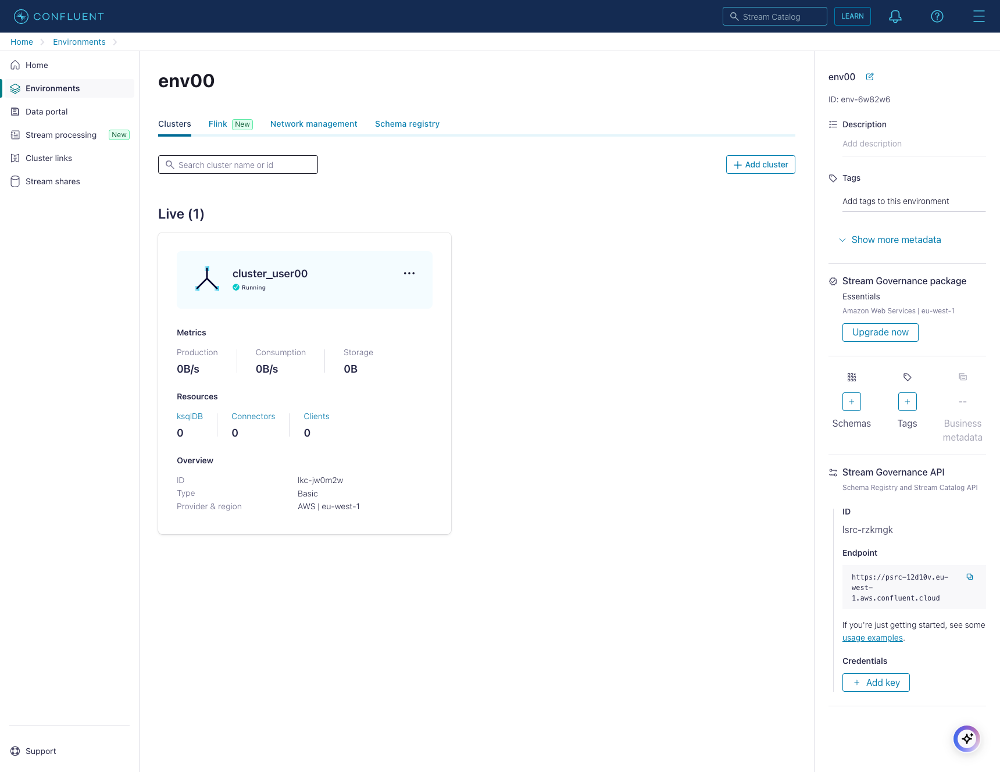
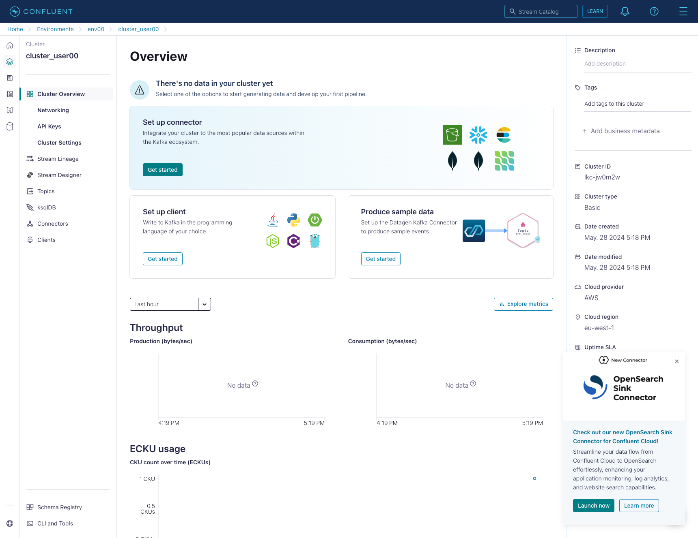
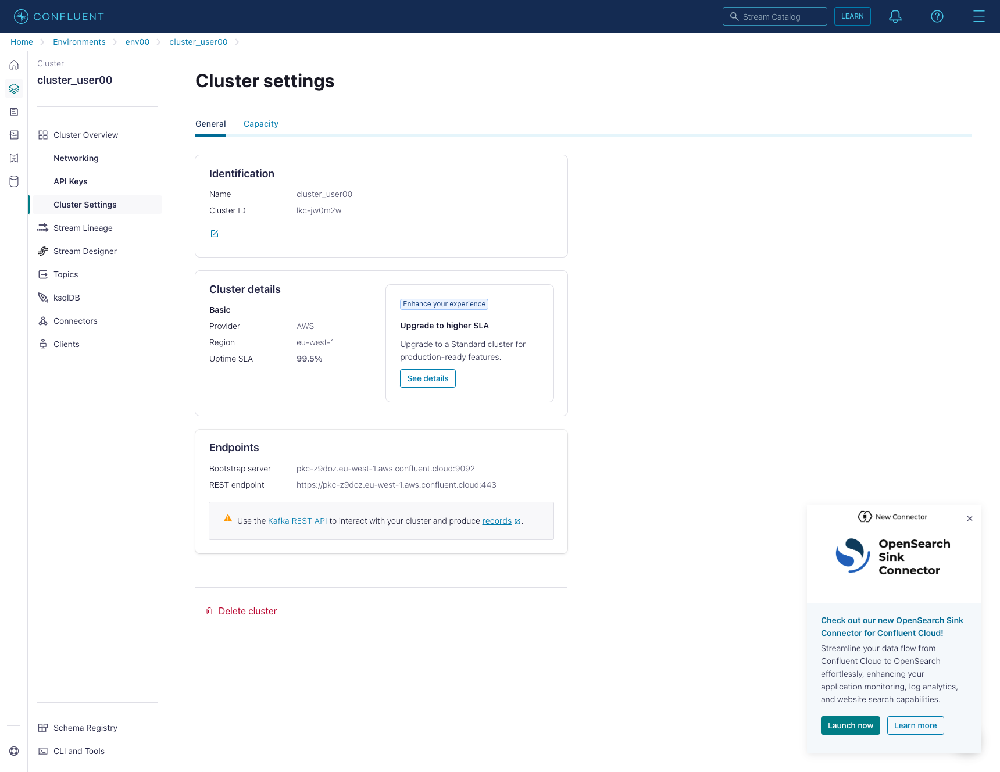

# Lab 1

## Content of Lab 1

[1. Confluent Cloud overview](lab1.md#1-confluent-cloud-overview)

[2. Creating a Confluent Cloud Kafka Cluster](lab1.md#2-creating-a-confluent-cloud-kafka-cluster)

[3. Creating a Kafka topic](lab1.md)

[4. Generating dummy data with Kafka Connect DataGen Source Connector](lab1.md)

[5. Visizualing data](lab1.md)

## 1. Confluent Cloud overview
Login to [Confluent Cloud](https://confluent.cloud) with the username and password communicated to you prior to the workshop.

Confluent Cloud is organized around the following structure:
* [Organization](https://docs.confluent.io/cloud/current/access-management/hierarchy/organizations/cloud-organization.html): An organization is a root node in Conflient Cloud.
Usually an organisation represents a company or a subsidiary (one user can be attached to multiple orgs but the billing is made per organisation).

* [Environment](https://docs.confluent.io/cloud/current/access-management/hierarchy/cloud-environments.html): An environment host the technical components like Kafka Clusters, Flink Compute pools or a Schema Registry.
You can define multiple environments in an organization.
Usually an environement represents a departement or a a project stage (production vs dev).

Confluent Cloud implements [predefined RBAC roles](https://docs.confluent.io/cloud/current/access-management/access-control/rbac/predefined-rbac-roles.html) in order to restrict the access to certain resources.

> **_QUESTION:_**  Can you guess which role you currently have?

## 2. Creating a Confluent Cloud Kafka Cluster

Time to create your very first Kafka Cluster!
For the scope of the workshop, everything will be done using the Confluent UI.
Of course, everything can be done via the [Command Line]((https://docs.confluent.io/confluent-cli/current/install.html) ) (aka. CLI), via [API](https://docs.confluent.io/cloud/current/api.html) or using [Confluent's Terraform provider](https://registry.terraform.io/providers/confluentinc/confluentcloud/latest/docs)

The following steps will guide you through the creation process, if you want a more complete guide, we highly suggest t have a look to [Manage Kafka Clusters on Confluent Cloud
](https://docs.confluent.io/cloud/current/clusters/create-cluster.html)

Let's start from your environement and click on `Create Cluster on my own`.

Confluent Cloud proposes different types of Kafka Cluster.
Each of them have it's own characteristics macthing different requirements

> **_QUESTION:_**  According to the [Cluster limit comparison](https://docs.confluent.io/cloud/current/clusters/cluster-types.html), can you guess which cluster types Michelin is using?

For the workshop scope, you'll be creating a `Basic` cluster

